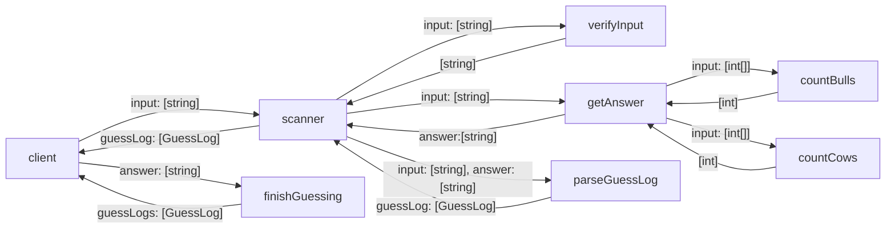

# Bulls and Cows

## Business Requirement

- There is a judge and a player in the game.  At the very beginning of every round of the game, the judge will randomly set a 4-digits number as secret(the digits must be all different). Then the player try to guess the secret. 

- The judge will answer the guess from player in form of ‘xAyB’. If the matching digits are in their right positions, they are “bulls”, if in different positions, they are “cows”. ’x’ represents the number of bulls, and ‘y’ represents the number of cows.

- In every round of game, the player has 6 chances to guess. 

- Each time judge answer the guess , it will give the results of the current guess and all guessed records(including guess and answer) for the player's reference.

For example: the secret is 1 2 3 4, then there are the following outputs based on different inputs
 
| Guess | Answer| Meaning of Answer|
| ------------- |:-------------:| -----:|
|1 5 6 7| 1A0B| '1' is correct |
|2 4 7 8| 0A2B|'2' & '4' are in wrong positions|
|0 3 2 4|1A2B| '4' is correct, '2' & '3' are in wrong positions|
|5 6 7 8|0A0B|all wrong
|4 3 2 1|0A4B|all in wrong positions
|1 2 3 4|4A0B|all correct
|1 1 2 3|Wrong Input, input again | Wrong Input, input again
|1 2|Wrong Input, input again  |Wrong Input, input again

## Practice Requirement

1. Draw the whole task diagram firstly.
2. Design and write tests for a task.
3. Implement the above task use TDD approach.
4. Repeat step 2&3 until all tasks are implemented.

## Tasking
1. given 输入位数不够的数字 12 when 调用verifyInput then 返回 Wrong Input, input again
2. given 输入存在重复数字的数字 1123 when 调用verifyInput then 返回 Wrong Input, input again
3. given input 1234 and secretNumber is 1234 when countBulls then return 4
4. given input 4321 and secretNumber is 1234 when countCows then return 4
5. given input 5678 and secretNumber is 1234 when getAnswer then return '0A0B'
6. given input 0324 and secretNumber is 1234 when getAnswer then return '1A2B'
7. given answer 4A0B and input 1234 when parseGuessLog then return GuessLog
8. given when 调用 createSecret then 返回4位不重复的数字
9. given secretNumber is 1234 and input 0324 when guess then print Meaning of Answer and waiting for next input
10. given secretNumber is 1234 and input 1234 when guess then print guessing history

## Task diagram

