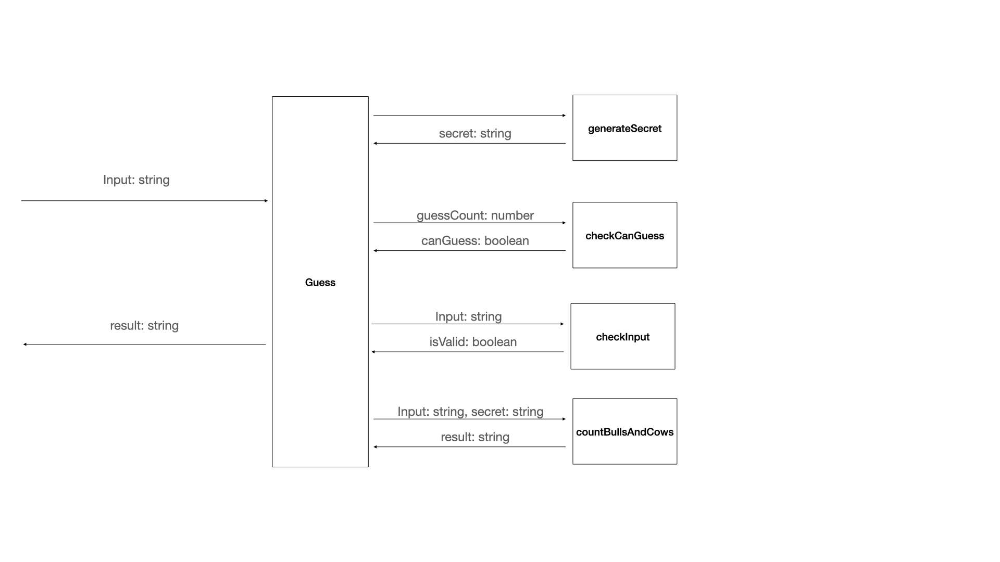

# Task
1. Generate a secret
    * Input: 
    * Output: secret: string
2. Check user input
    * Input: string
    * Output: exception?
3. check can guess
    * Input: guessesCount: number
    * output: canGuess: boolean
4. count bulls and cows
    * Input: secret: string, input: string
    * Output: result: string

# Context Map

