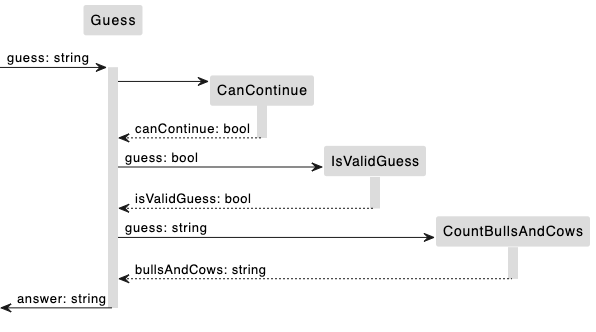

# Tasking
1. Generate answer based on the guess
    - Input: guess: string
    - Output: answer: string
1. Check if the player can continue to guess
    - Input:
    - Output: canContinue: bool
1. Verify if the guess is valid
    - Input: guess: string
    - Output: isValidGuess: bool
1. Generate bulls and Cows string based on a valid guess
    - Input: guess: string
    - Output: answer: string

# Context Map

